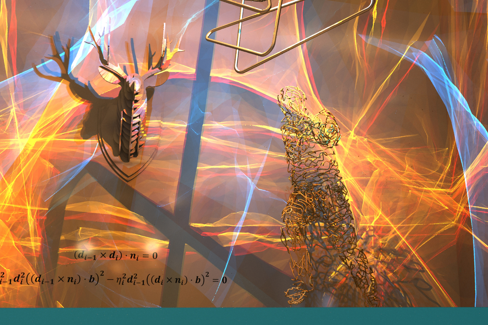

# Specular Polynomials

Zhimin Fan, Jie Guo, Yiming Wang, Tianyu Xiao, Hao Zhang

Chenxi Zhou, Zhenyu Chen, Pengpei Hong, Yanwen Guo, Ling-Qi Yan

*ACM Transactions on Graphics (Proceedings of SIGGRAPH 2024)*

A reformulation of specular constraints into polynomial systems that enables efficiently finding a complete set of all admissible specular paths connecting two arbitrary endpoints in a scene, by converting the problem into finding zeros of the determinant of univariate matrix polynomials.



## Standalone demo

We provide a minimalist demo: **a single** cpp source file `standalone.cpp` that only relies on the C++ standard libraries, which could help you understand how the method works without diving into the full project.

Just build it with any modern C++ compiler (g++, msvc, ...) and check how the vertex info of triangles are changed into bivariate polynomials and univariate polynomial matrices.

## Build the full project

```
cd mts1
mkdir cbuild
cd cbuild
cmake ..
```

Then build the generated project in `cbuild`.

Tested on Windows 10, Visual Studio 2022.

The implementation builds upon [Mbglints](https://github.com/wangningbei/mbglints) and [CyPolynomials](http://codebase.cemyuksel.com/code.html). 

## Reproduce

We provide several experiments in the `test` dir. Just run them and check the results. Please refer to any additional comments in the scripts.

---

Currently, in this repo, only single reflection (R) is fully supported. Other cases will be available soon. 

Note that although the current code contains implementations for other cases and even alternative building blocks for some parts of the pipeline, they are NOT guaranteed to be correct/complete.

---

## Abstract

Finding valid light paths that involve specular vertices in Monte Carlo rendering requires solving many non-linear, transcendental equations in high-dimensional space. Existing approaches heavily rely on Newton iterations in path space, which are limited to obtaining at most a single solution each time and easily diverge when initialized with improper seeds.

We propose specular polynomials, a Newton iteration-free methodology for finding a complete set of admissible specular paths connecting two arbitrary endpoints in a scene. The core is a reformulation of specular constraints into polynomial systems, which makes it possible to reduce the task to a univariate root-finding problem. We first derive bivariate systems utilizing rational coordinate mapping between the coordinates of consecutive vertices. Subsequently, we adopt the hidden variable resultant method for variable elimination, converting the problem into finding zeros of the determinant of univariate matrix polynomials. This can be effectively solved through Laplacian expansion for one bounce and a bisection solver for more bounces.

Our solution is generic, completely deterministic, accurate for the case of one bounce, and GPU-friendly. We develop efficient CPU and GPU implementations and apply them to challenging glints and caustic rendering. Experiments on various scenarios demonstrate the superiority of specular polynomial-based solutions compared to Newton iteration-based counterparts.


## Links

[Paper](https://zhiminfan.work/paper/spoly_preprint.pdf)
[Supplemental](https://zhiminfan.work/paper/spoly_preprint_supp.pdf)
